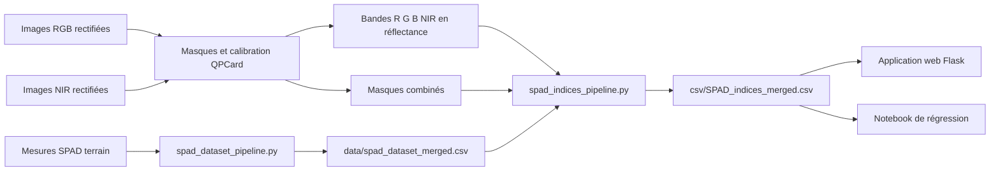

# Estimation du SPAD à partir d’images RGB–NIR

Ce projet construit un jeu de données reliant des mesures de chlorophylle **SPAD** à des informations extraites d’images multispectrales acquises avec une caméra Tricam. Il regroupe dans un même flux :

- l’association des mesures SPAD aux parcelles et aux images ;
- la calibration radiométrique avec une mire QPCard ;
- l’exploitation des bandes rouge, verte, bleue et proche infrarouge ;
- l’application d’un masque de végétation nettoyé ;
- le calcul pixel par pixel de cinq indices spectraux ;
- le résumé de chaque image par la moyenne, la médiane et le mode ;
- la production d’un CSV scientifique unique ;
- l’exploration interactive des résultats dans une application Flask ;
- la modélisation du SPAD dans un notebook Jupyter.

Le pipeline principal est un ensemble de scripts Python autonomes. Il n’utilise ni Airflow ni DAG et ne sauvegarde aucun tableau `.npy` ni graphique de distribution des indices.

Documentation complémentaire : [app_data](app_data/)

## Vue d’ensemble du flux



Le fichier central du projet est `csv/SPAD_indices_merged.csv`. Il contient une ligne par image/parcelle analysée et rassemble les mesures SPAD, les métadonnées de prise de vue, les statistiques des bandes, les statistiques des cinq indices et les informations de mire.

## État actuel du jeu de données

Les volumes ci-dessous correspondent aux fichiers présents dans le projet au 11 septembre 2026.

| Site ou acquisition | Plots dans `spad_dataset_merged.csv` | Images dans le CSV final |
|---|---:|---:|
| Clermont-Ferrand | 80 | 70 |
| Mauguio | 104 | 104 |
| Toulouse | 99 | 99 |
| Zurich — 2026-03-23 | 51 | 51 |
| Zurich — 2026-04-07 | 52 | 36 |
| Zurich — 2026-04-21 | 52 | 52 |
| Zurich — 2026-05-05 | 52 | 52 |
| Zurich — 2026-06-01 | 46 | 46 |
| **Total** | **536** | **510** |

La différence entre les 536 plots SPAD et les 510 lignes finales provient des images ignorées lorsque l’une des entrées indispensables est absente ou invalide : bande de réflectance, masque combiné ou dimensions compatibles.

Le dossier `data/greoux/` contient également des données de travail, mais il n’est pas représenté dans le CSV final actuel.

## Organisation du projet

```text
zakaria/
├── data/
│   ├── ground_truth_spad/          # fichiers terrain SPAD d’origine
│   ├── clermont-ferrand/
│   ├── mauguio/
│   ├── toulouse/
│   └── zurich/
│       └── <date>/
├── csv/
│   ├── SPAD_indices_merged.csv     # résultat global courant
│   └── SPAD_indices_<date_heure>.csv
├── models/                         # modèles TorchScript de segmentation
├── processing/
│   ├── deep_models/                # prédicteurs de masques TorchScript
│   ├── combine_masks.py            # composition des masques élémentaires
│   ├── decalage.py                 # calcul du décalage de la mire RGB/NIR
│   ├── distribution.py             # distributions sous masque combiné
│   ├── mask_shift.py               # calcul et application d’une translation
│   ├── qpcard_postprocessing.py    # nettoyage du masque de mire
│   ├── reflectance_distribution.py # fonctions de tracé des bandes
│   └── spad_indices_pipeline.py    # calcul statistique principal
├── reflectance_qpcard/
│   └── reflectance.py              # calibration en réflectance
├── utils/
│   ├── helper.py                   # outil manuel de masque à quatre points
│   └── spad_dataset_pipeline.py    # mappings et fusion SPAD
├── web_app/
│   ├── app.py
│   ├── custom_indices.json
│   └── templates/index.html
├── app_data/                       # documentation complémentaire
├── simple.ipynb                    # analyse et régression SPAD
└── README.md
```

## Détail du dossier `processing/`

Le dossier `processing/` contient les traitements appliqués aux images, aux masques et aux bandes de réflectance. Certains fichiers sont des scripts directement exécutables ; d’autres sont des modules appelés par ces scripts.

### Tableau récapitulatif

| Fichier | Rôle | Entrée principale | Sortie principale | État actuel |
|---|---|---|---|---|
| `processing/__init__.py` | Expose les outils de translation de masque | — | API Python | Utilisable |
| `processing/mask_shift.py` | Calcule et applique le décalage entre deux masques | Deux masques NumPy | `(dx, dy)` ou masque translaté | Utilisable |
| `processing/decalage.py` | Calcule le décalage QPCard RGB/NIR pour chaque site | `helper/mask_*Camera1*` et `mask_*Camera3*` | `masks/qpcard_nir_shift.json` | Utilisable |
| `processing/qpcard_postprocessing.py` | Nettoie un masque QPCard dans le bas de l’image | Masque QPCard binaire | Masque remplacé par son enveloppe convexe | Utilisable comme module |
| `processing/deep_models/_base.py` | Infrastructure commune d’inférence TorchScript | Image RGB et modèle | Masque binaire 0/255 | Utilisable |
| `processing/deep_models/qpcard.py` | Segmente la mire QPCard | Image RGB | `masks/qpcard/*.png` | Utilisable |
| `processing/deep_models/ombre.py` | Segmente les ombres | RGB + masque de végétation | `masks/ombres/*.png` | Utilisable |
| `processing/deep_models/speculaire.py` | Segmente les reflets spéculaires | RGB + masque de végétation | `masks/speculaires/*.png` | Utilisable |
| `processing/deep_models/epi.py` | Segmente les épis | Image RGB | `masks/epi/*.png` | Utilisable |
| `processing/deep_models/tige.py` | Segmente les tiges | Image RGB | `masks/tige/*.png` | Utilisable |
| `processing/combine_masks.py` | Construit le masque final de pixels autorisés | Masques élémentaires | `masks/combined/*.png` | À refactoriser |
| `processing/spad_indices_pipeline.py` | Calcule les indices et toutes les statistiques finales | Réflectance, masque, XML et SPAD | CSV par site et CSV global | Utilisable |
| `processing/reflectance_distribution.py` | Trace les distributions des quatre bandes | TIFF de réflectance | Figure PNG | À refactoriser |
| `processing/distribution.py` | Applique le masque combiné avant les distributions | Réflectance + masque combiné | `distribution/combined/*.png` | À refactoriser |

### `processing/__init__.py`

Ce fichier transforme `processing` en package Python et rend directement accessibles trois éléments de `mask_shift.py` :

```python
from processing import MaskShift, get_centroid, shift_mask
```

Il ne lance aucun traitement et ne crée aucun fichier.

### `processing/mask_shift.py`

Ce module contient la logique mathématique de recalage de deux masques binaires.

#### `get_centroid(mask)`

La fonction utilise les moments géométriques d’OpenCV pour calculer le centre du contenu blanc :

```text
cx = m10 / m00
cy = m01 / m00
```

Si le masque est vide, `m00` vaut zéro et une exception est levée. Il faut donc que chaque masque contienne au moins un pixel non nul.

#### `MaskShift(mask_rgb, mask_nir)`

La classe calcule les centroïdes des deux masques puis le déplacement nécessaire pour déplacer le masque RGB vers la position du masque NIR :

```text
dx = cx_nir - cx_rgb
dy = cy_nir - cy_rgb
```

`get_shift()` arrondit ces déplacements au pixel entier le plus proche. `shift_mask()` renvoie une copie du masque RGB translatée de `(dx, dy)`.

#### `shift_mask(mask, shift_x, shift_y)`

Cette fonction applique directement une translation horizontale et verticale à un tableau NumPy. Les nouvelles zones sont remplies avec des zéros et les pixels déplacés hors de l’image sont supprimés. Il n’y a ni interpolation ni redimensionnement.

Exemple d’utilisation :

```python
import cv2
from processing.mask_shift import MaskShift

rgb = cv2.imread("mask_rgb.png", cv2.IMREAD_GRAYSCALE)
nir = cv2.imread("mask_nir.png", cv2.IMREAD_GRAYSCALE)

alignment = MaskShift(rgb, nir)
dx, dy = alignment.get_shift()
rgb_aligned = alignment.shift_mask()
```

### `processing/decalage.py`

Ce script applique `MaskShift` à l’échelle du projet. Il découvre récursivement les dossiers contenant `helper/`, cherche un masque dont le nom contient `Camera1` pour le RGB et un masque contenant `Camera3` pour le NIR, puis calcule leurs centroïdes.

La sortie est un fichier JSON par acquisition :

```json
{
  "dx": 12,
  "dy": -3,
  "rgb_helper": "mask_...Camera1....png",
  "nir_helper": "mask_...Camera3....png"
}
```

Ce script enregistre seulement le déplacement. Il n’enregistre pas une nouvelle image de masque translatée. La calibration QPCard lit ensuite ce JSON pour appliquer le recalage au bon moment.

```powershell
python processing/decalage.py
python processing/decalage.py data/toulouse
python processing/decalage.py --rgb-camera-tag Camera1 --nir-camera-tag Camera3
```

### `processing/qpcard_postprocessing.py`

Ce module nettoie la forme prédite de la mire QPCard. La fonction `perfect_mask_bottom_polygon(...)` :

1. conserve uniquement la fraction inférieure de l’image, 25 % par défaut ;
2. binarise cette zone avec un seuil de 127 ;
3. détecte tous les contours blancs ;
4. rassemble leurs points ;
5. construit une enveloppe convexe unique ;
6. replace cette enveloppe dans les coordonnées de l’image entière ;
7. écrit un masque binaire 0/255 de la taille originale.

L’objectif est de transformer plusieurs fragments de segmentation en un polygone continu représentant la mire située en bas de l’image.

La fonction `process_dataset(...)` applique ce nettoyage à tous les PNG d’un dossier `masks/qpcard/`. Le bloc `if __name__ == "__main__"` contient toutefois encore des chemins d’exemple fixes ; pour le projet, il faut donc importer la fonction ou utiliser le post-traitement appelé par `deep_models/qpcard.py`.

### `processing/deep_models/_base.py`

Ce fichier évite de répéter le code d’inférence dans chaque modèle. La classe `BaseMaskPredictor` prend en charge :

- le chargement d’un modèle avec `torch.jit.load` ;
- le choix entre CUDA et CPU ;
- la conversion OpenCV BGR vers RGB ;
- la normalisation ImageNet des trois canaux ;
- le padding pour respecter le stride du réseau ;
- l’inférence sur l’image entière ou par tuiles ;
- la conversion des sorties du réseau en masque binaire 0/255 ;
- la remise à la taille originale ;
- l’écriture du masque avec OpenCV.

En mode tuilé, les probabilités des zones qui se chevauchent sont moyennées avant l’application du seuil `0,5`. Cette méthode limite l’utilisation de la mémoire GPU sur les grandes images.

La fonction commune `run_dataset(...)` parcourt `images_rgb_rect/`, ignore les masques déjà présents, exécute le prédicteur et écrit le résultat dans `masks/<classe>/`.

### `processing/deep_models/qpcard.py`

Ce prédicteur utilise par défaut `models/qpcard_final.pt`. Le traitement par tuiles utilise une taille de 512 pixels et un pas de 256 pixels. La sortie est un masque de mire dans `masks/qpcard/`.

Pour une image unique :

```powershell
python -m processing.deep_models.qpcard data/toulouse/images_rgb_rect/<image>.png --device cpu
```

L’option `--bottom-fraction` contrôle la partie inférieure utilisée par le post-traitement. Pour une image unique, le masque est nettoyé après l’inférence. Pour un dataset lancé via `process_dataset(...)`, le post-traitement n’est actuellement pas transmis à `run_dataset` et doit être exécuté séparément si nécessaire.

### `processing/deep_models/ombre.py`

Ce prédicteur utilise `models/ombres_final.pt` et travaille par tuiles. Avant l’inférence dataset, il charge `masks/vegetation/<image>.png` et remplace par du blanc les pixels situés hors de la végétation. La segmentation se concentre ainsi sur les ombres de la plante. Les sorties sont écrites dans `masks/ombres/`.

```powershell
python -m processing.deep_models.ombre data/toulouse/images_rgb_rect/<image>.png --device cpu
```

Pour la commande sur une image unique, ce prétraitement par le masque de végétation n’est pas appliqué : il est seulement utilisé par `process_dataset(...)`.

### `processing/deep_models/speculaire.py`

Ce prédicteur utilise `models/speculaire_final.pt`. Pour le traitement dataset, les pixels extérieurs au masque `masks/vegetation/` sont remplacés par du noir avant l’inférence. Les reflets détectés sont écrits dans `masks/speculaires/`.

```powershell
python -m processing.deep_models.speculaire data/toulouse/images_rgb_rect/<image>.png --device cpu
```

Comme pour les ombres, la commande sur une image unique reçoit directement l’image fournie et n’applique pas le masque de végétation automatiquement.

### `processing/deep_models/epi.py`

Ce module segmente les épis avec le modèle `models/MAnet_pvt_v2_b2_ble_epi_v2_2026_04_23.torchscript`. Il utilise un padding par réflexion et l’inférence en précision mixte sur CUDA. La sortie dataset est `masks/epi/`.

```powershell
python -m processing.deep_models.epi data/toulouse/images_rgb_rect/<image>.png --device cpu
```

### `processing/deep_models/tige.py`

Ce module segmente les tiges avec `models/MAnet_pvt_v2_b2_ble_tige_2026_04_22.torchscript`. Il utilise également le padding par réflexion et la précision mixte sur CUDA. La sortie dataset est `masks/tige/`.

```powershell
python -m processing.deep_models.tige data/toulouse/images_rgb_rect/<image>.png --device cpu
```

### `processing/deep_models/__init__.py`

Ce fichier rassemble les cinq classes de prédiction et leur fonction dataset sous des noms courts :

```python
from processing.deep_models import (
    process_epi,
    process_ombres,
    process_qpcard,
    process_speculaires,
    process_tige,
)
```

Les arguments `data_root` doivent être fournis comme objets `Path` :

```python
from pathlib import Path
process_epi(data_root=Path("data/toulouse"))
```

### `processing/combine_masks.py`

Ce script décrit le masque final par la logique suivante :

```text
combined = vegetation
           ET NON ombre
           ET NON reflet_spéculaire
           ET NON épi
           ET NON tige
           ET NON végétation_sénescente
           ET masque_de_hauteur
```

Les seuils de hauteur sont propres à chaque acquisition :

| Acquisition | Intervalle de hauteur utilisé |
|---|---|
| Clermont-Ferrand | 45–100 cm |
| Mauguio | 20–100 cm |
| Toulouse | 20–100 cm |
| Zurich 2026-03-23 | 8–100 cm |
| Zurich 2026-04-07 | 10–100 cm |
| Zurich 2026-04-21 | 20–88 cm |
| Zurich 2026-05-05 | 44–100 cm |
| Zurich 2026-06-01 | 40–100 cm |

La sortie prévue est `masks/combined/<stem>.png`, avec 255 pour un pixel autorisé et 0 pour un pixel exclu.

État actuel : ce fichier importe encore les fonctions de lecture et de détection depuis `processing.spad_pixel_stats`, qui a été supprimé lors de la simplification du projet. Il échouera donc à l’import tant que ces fonctions ne seront pas déplacées dans un nouveau module autonome. Les masques combinés déjà générés ne sont pas affectés.

### `processing/spad_indices_pipeline.py`

Il s’agit du script principal de calcul scientifique. Il remplace les anciens scripts d’indices, de statistiques SPAD et d’intensité de mire. Son fonctionnement complet, les cinq formules et les 58 colonnes produites sont documentés dans les sections suivantes du README.

Entrées indispensables :

- `data/spad_dataset_merged.csv` ;
- les quatre fichiers `reflectance/{R,G,B,NIR}/<stem>.tif` ;
- `masks/combined/<stem>.png`.

Entrées complémentaires : les XML RGB/NIR et `reflectance/metrics_calibration.csv`.

Sorties : `data/<site>/spad_indices_stats.csv`, `csv/SPAD_indices_merged.csv` et une copie CSV horodatée.

### `processing/reflectance_distribution.py`

Ce module contient la fonction de visualisation des distributions de `B`, `G`, `R` et `NIR`. Pour chaque bande, il convertit les DN en pourcentage de réflectance, estime une densité KDE et trace la moyenne, la médiane et le mode. Les zéros NIR sont exclus.

État actuel : le chargement des bandes et la constante de normalisation sont encore importés depuis l’ancien `processing.spad_pixel_stats`. Le module doit être raccordé à `spad_indices_pipeline.py` ou recevoir son propre chargeur avant de pouvoir être utilisé seul.

Ce script est facultatif : les distributions visuelles ne sont pas produites par le pipeline final et ne sont pas nécessaires au CSV.

### `processing/distribution.py`

Ce script devait parcourir les TIFF présents sous `reflectance/B/`, appliquer `masks/combined/<stem>.png`, puis appeler `reflectance_distribution.py`. Les figures prévues sont :

```text
data/<site>/distribution/combined/<stem>.png
```

État actuel : il importe également `apply_mask` et `load_reflectance_bands` depuis le module supprimé `processing.spad_pixel_stats`. Il doit donc être refactorisé avant utilisation. Il n’est pas appelé par `spad_indices_pipeline.py`.

## `utils/helper.py` : création manuelle des masques de référence

`utils/helper.py` est une petite interface graphique Tkinter destinée à dessiner un masque polygonal à quatre points. Son usage principal est la création des masques de référence RGB et NIR nécessaires au calcul du décalage QPCard.

### Fonctionnement

1. cliquer sur **Open Image...** pour sélectionner une image ;
2. cliquer successivement sur les quatre coins de la mire ;
3. le polygone est fermé automatiquement au quatrième point ;
4. choisir l’emplacement du fichier dans la boîte de sauvegarde ;
5. enregistrer le masque avec un nom permettant d’identifier la caméra.

Le masque produit possède les mêmes dimensions que l’image source. Le polygone est blanc (`255`) et le reste de l’image est noir (`0`). Les coordonnées des clics sont converties depuis le canevas d’affichage de 900 × 650 pixels vers les dimensions originales.

Lancer l’outil :

```powershell
python utils/helper.py
```

Raccourcis disponibles :

| Action | Touche ou bouton |
|---|---|
| Ouvrir une image | `O` ou **Open Image...** |
| Charger une image aléatoire | `R` ou **Next (R)** |
| Effacer les quatre points | **Reset Points** |
| Quitter | `Q` ou **Quit** |

Pour le pipeline actuel, les fichiers doivent ensuite être placés dans le dossier du site :

```text
data/<site>/helper/mask_<nom>Camera1<...>.png
data/<site>/helper/mask_<nom>Camera3<...>.png
```

`Camera1` identifie le masque RGB et `Camera3` le masque NIR. `decalage.py` recherche ces textes dans les noms de fichiers.

La liste `DIRS = ["nir", "cler/rgb"]` utilisée par le bouton de chargement aléatoire est une ancienne configuration locale. Le bouton **Open Image...** fonctionne avec n’importe quel chemin et constitue la méthode recommandée dans l’organisation actuelle du projet.

## Structure attendue pour chaque site

Un site simple utilise directement `data/<site>/`. Zurich utilise la même structure dans `data/zurich/<date>/`.

```text
data/<site>/
├── images_rgb_rect/
│   └── <stem>.png
├── images_nir_rect/
├── xml_rgb_rect/
│   └── <stem>.xml
├── xml_nir_rect/
│   └── <stem Camera1 remplacé par Camera3>.xml
├── helper/
│   ├── mask_*Camera1*.png
│   └── mask_*Camera3*.png
├── masks/
│   ├── vegetation/
│   ├── ombres/
│   ├── speculaires/
│   ├── epi/
│   ├── tige/
│   ├── qpcard/
│   ├── combined/
│   │   └── <stem>.png
│   └── qpcard_nir_shift.json
├── reflectance/
│   ├── R/<stem>.tif
│   ├── G/<stem>.tif
│   ├── B/<stem>.tif
│   ├── NIR/<stem>.tif
│   └── metrics_calibration.csv
├── metadata/
├── spad_mapping.csv
└── spad_indices_stats.csv
```

`<stem>` désigne le nom de l’image sans extension. Les noms doivent être identiques entre l’image RGB, les quatre TIFF de réflectance et le masque combiné.

## Installation

### Environnement minimal pour le pipeline principal

Python 3.10 ou une version compatible est recommandé.

```powershell
conda create -n spad-pipeline python=3.10
conda activate spad-pipeline
python -m pip install numpy pandas scipy opencv-python openpyxl
```

### Application web, notebook et calibration complète

```powershell
python -m pip install flask matplotlib scikit-learn pyyaml pillow jupyter
```

`pillow` est utilisé par l’interface graphique `utils/helper.py`. Tkinter est généralement inclus avec Python sous Windows ; s’il manque dans une autre installation, il doit être ajouté avec le gestionnaire de paquets de cette installation Python.

Les modèles de segmentation dans `processing/deep_models/` nécessitent également PyTorch. Installer la version de `torch` adaptée au CPU ou à la version CUDA de la machine. Les dépendances de la calibration sont aussi indiquées dans `reflectance_qpcard/requirements.txt`.

Toutes les commandes suivantes doivent être lancées depuis la racine du projet :

```powershell
Set-Location D:\zakaria
```

## Préparation des images et des masques

### 1. Alignement RGB/NIR de la mire

`processing/decalage.py` recherche dans `helper/` un masque RGB contenant `Camera1` et un masque NIR contenant `Camera3`. Il estime leur déplacement puis écrit :

```text
data/<site>/masks/qpcard_nir_shift.json
```

Traiter automatiquement tous les sites :

```powershell
python processing/decalage.py
```

Traiter seulement certains sites :

```powershell
python processing/decalage.py data/toulouse data/mauguio
```

Les options `--rgb-camera-tag` et `--nir-camera-tag` permettent de modifier les identifiants de caméra.

### 2. Calibration de réflectance QPCard

`reflectance_qpcard/reflectance.py` utilise l’alignement précédent et les réflectances théoriques de la QPCard pour calibrer les bandes. Il génère notamment les TIFF 16 bits dans `reflectance/R`, `G`, `B` et `NIR`, les métriques de calibration et, si demandé, les figures de diagnostic.

```powershell
python reflectance_qpcard/reflectance.py
```

Sans graphiques de diagnostic :

```powershell
python reflectance_qpcard/reflectance.py --no-plots
```

Pour un seul site :

```powershell
python reflectance_qpcard/reflectance.py data/toulouse --no-plots
```

### 3. Masques de segmentation

Les classes gérées dans `processing/deep_models/` comprennent notamment la QPCard, les ombres, les reflets spéculaires, les épis et les tiges. Le socle commun charge les modèles TorchScript depuis `models/`, utilise CUDA lorsqu’elle est disponible et revient au CPU si nécessaire.

Exemple pour produire le masque d’épis d’une image :

```powershell
python -m processing.deep_models.epi data/toulouse/images_rgb_rect/<image>.png --device cpu
```

Les fonctions `process_dataset(...)` de ces modules permettent aussi de traiter un dossier complet et d’écrire les résultats sous `masks/<classe>/`.

### 4. Masque combiné final

Le calcul des indices attend un masque binaire :

```text
data/<site>/masks/combined/<stem>.png
```

Un pixel non nul est conservé. Le scénario conceptuel combine la végétation et retire les ombres, reflets spéculaires, épis, tiges et végétation sénescente, puis applique le masque de hauteur propre au site.

Important : le pipeline `spad_indices_pipeline.py` ne fabrique pas ce masque. Il suppose que `masks/combined/` existe déjà. Le fichier `processing/combine_masks.py` est un utilitaire de composition conservé dans le projet, mais il référence encore des fonctions de l’ancien module `processing/spad_pixel_stats.py`. Après suppression de ce module historique, cet utilitaire doit être refactorisé avant de pouvoir régénérer les masques combinés depuis zéro. Les masques combinés déjà présents restent directement utilisables.

## Construction du dataset SPAD

Le script `utils/spad_dataset_pipeline.py` remplace les anciens scripts séparés `spad.py` et `merge_spad_dataset.py`.

Il réalise deux opérations :

1. création d’un `spad_mapping.csv` par site ou date, à partir des fichiers terrain et des noms d’images ;
2. normalisation et fusion de tous les mappings dans `data/spad_dataset_merged.csv`.

Les sources attendues sont :

| Site | Source principale | Date associée |
|---|---|---|
| Clermont-Ferrand | `SPAD_Clermont_20-05-26_PhB.xlsx` | 2026-05-20 |
| Toulouse | `SPAD_Auzeville_23_04_26.xlsx` et plan CSV facultatif | 2026-04-23 |
| Mauguio | `SPAD_Mauguio_16_04_26.csv` | 2026-04-16 |
| Zurich | feuille `Tabelle1` de `Yara.xlsx` | cinq dates de mars à juin 2026 |

Pour Zurich, une mesure HNT est convertie en SPAD selon l’équation utilisée dans le code :

```text
SPAD = 0,0639 × HNT + 5,84
```

### Commandes

Créer les mappings puis le fichier fusionné :

```powershell
python utils/spad_dataset_pipeline.py
```

Créer uniquement les mappings :

```powershell
python utils/spad_dataset_pipeline.py --mappings-only
```

Fusionner uniquement les mappings déjà présents :

```powershell
python utils/spad_dataset_pipeline.py --merge-only
```

Le fichier fusionné contient les colonnes : `Site`, `Plot`, `spad_mean`, `Image`, `Variete`, `Date`, `Feuille_1`, `Feuille_2` et `Feuille_3`.

Lorsqu’un plot possède plusieurs lignes, `spad_mean` est moyenné au niveau du couple `(Site, Plot)`. Une image dont les bandes de réflectance et le masque combiné existent est prioritaire comme image représentative.

## Calcul des bandes, des indices et des statistiques

Le cœur du projet est `processing/spad_indices_pipeline.py`.

Pour chaque ligne de `data/spad_dataset_merged.csv`, il :

1. charge `R`, `G`, `B` et `NIR` depuis les TIFF de réflectance ;
2. convertit les valeurs 16 bits en fractions de réflectance par `DN / 65536` ;
3. charge le masque combiné ;
4. calcule les cinq indices sur toute l’image, pixel par pixel ;
5. conserve seulement les pixels autorisés par le masque ;
6. élimine les valeurs non finies ;
7. calcule la moyenne, la médiane et le mode de chaque indice ;
8. calcule les mêmes statistiques sur les quatre bandes ;
9. lit les métadonnées XML RGB et NIR ;
10. calcule les variables liées à la mire ;
11. écrit les résultats par site et dans un CSV global.

### Les cinq indices spectraux

Pour chaque pixel valide, avec `R`, `G`, `B` et `NIR` exprimés en réflectance entre 0 et 1 :

| Nom dans le CSV | Formule |
|---|---|
| `rb_index` | `(R - B) / (R + B)` |
| `br_bnir_index` | `(B - R) / (B + NIR)` |
| `ci_green` | `NIR / G - 1` |
| `nir_b_gb_index` | `(NIR - B) / (G - B)` |
| `nir_gb_ratio_index` | `NIR / (G - B)` |

Une division est considérée invalide lorsque la valeur absolue du dénominateur est inférieure ou égale à `0,01`. Le résultat devient alors `NaN` et ce pixel n’entre pas dans les statistiques de l’indice concerné.

### Moyenne, médiane et mode

Les trois valeurs ne sont pas calculées directement à partir des quatre bandes réunies. Elles sont calculées séparément :

- pour chacun des cinq tableaux d’indices ;
- pour chacune des quatre bandes `R`, `G`, `B` et `NIR`.

La moyenne est la moyenne arithmétique des pixels valides. La médiane coupe les valeurs triées en deux groupes égaux. Comme les données sont continues, le mode est estimé par densité à noyau gaussien (KDE). Pour limiter le coût, au maximum 50 000 pixels sont échantillonnés pour cette estimation. Un histogramme de 100 classes sert de solution de secours si la KDE échoue.

Les statistiques des bandes sont exportées en **pourcentage de réflectance** (`réflectance × 100`). Les indices restent sans unité. Les pixels NIR égaux à zéro sont exclus des statistiques de la bande NIR, car ils peuvent provenir du décalage spatial.

### Métadonnées XML

Le XML RGB associé à `<stem>` fournit :

- `DateTime` ;
- `ISOSpeedRatings_rgb` ;
- `ExposureTime_rgb`.

Le XML NIR est recherché avec le même nom après remplacement de `Camera1` par `Camera3`, et fournit les champs équivalents suffixés par `_nir`. Un champ absent ou un XML illisible laisse une valeur vide sans arrêter tout le traitement.

### Informations de mire QPCard

Les pentes sont lues dans `reflectance/metrics_calibration.csv` pour chaque couple `(image, bande)`. L’implémentation calcule :

```text
intensité_patch = réflectance_théorique_patch / pente
TI              = ExposureTime / 1 000 000
gain            = ISO / 100
DN_gris         = intensité_gris × TI × gain
```

Réflectances théoriques utilisées :

| Patch | R | G | B | NIR |
|---|---:|---:|---:|---:|
| Noir | 0,071405 | 0,072839 | 0,072962 | 0,065163 |
| Gris | 0,152181 | 0,156171 | 0,155624 | 0,132566 |
| Blanc | 0,815291 | 0,806183 | 0,787966 | 0,872626 |

Le CSV conserve l’intensité grise pour les quatre bandes, les DN gris estimés pour les quatre bandes, ainsi que les intensités noire et blanche pour `R` et `NIR`.

### Exécution

Tous les sites du mapping SPAD :

```powershell
python processing/spad_indices_pipeline.py
```

Un ou plusieurs sites :

```powershell
python processing/spad_indices_pipeline.py toulouse mauguio
python processing/spad_indices_pipeline.py "zurich/2026-04-21"
```

Test rapide sur deux images par site avec quatre workers :

```powershell
python processing/spad_indices_pipeline.py --max-images 2 --workers 4
```

Les erreurs propres à une image — fichier absent ou dimensions incompatibles — sont affichées avec `[SKIP]`. Le traitement continue pour les autres images.

## Fichiers CSV produits

Le pipeline écrit trois niveaux de résultat :

```text
data/<site>/spad_indices_stats.csv
csv/SPAD_indices_merged.csv
csv/SPAD_indices_<AAAAMMJJ_HHMMSS>.csv
```

- `spad_indices_stats.csv` contient les résultats du site concerné ;
- `SPAD_indices_merged.csv` est remplacé par le résultat global du dernier lancement ;
- le fichier horodaté conserve une copie de ce lancement.

Le CSV global actuel contient **510 lignes et 58 colonnes**.

### Détail des 58 colonnes

| Groupe | Nombre | Colonnes |
|---|---:|---|
| Identification et SPAD | 7 | `Site`, `Plot`, `spad_mean`, `Variete`, `Image`, `Date`, `DateTime` |
| Prise de vue | 4 | `ISOSpeedRatings_rgb`, `ExposureTime_rgb`, `ISOSpeedRatings_nir`, `ExposureTime_nir` |
| Mesures feuille et masque | 4 | `Feuille_1`, `Feuille_2`, `Feuille_3`, `Nb_pixels` |
| Statistiques des indices | 15 | `Mean_*`, `Median_*`, `Mode_*` pour les 5 indices |
| Statistiques des bandes | 12 | `Mean_*`, `Median_*`, `Mode_*` pour `R`, `G`, `B`, `NIR` |
| Mire et exposition | 16 | intensités de mire, DN gris, temps d’intégration et gains |

Les 15 colonnes d’indices sont :

```text
Mean_rb_index, Median_rb_index, Mode_rb_index
Mean_br_bnir_index, Median_br_bnir_index, Mode_br_bnir_index
Mean_ci_green, Median_ci_green, Mode_ci_green
Mean_nir_b_gb_index, Median_nir_b_gb_index, Mode_nir_b_gb_index
Mean_nir_gb_ratio_index, Median_nir_gb_ratio_index, Mode_nir_gb_ratio_index
```

Les 16 colonnes de mire sont :

```text
intensite_mire_R, intensite_mire_G, intensite_mire_B, intensite_mire_NIR
DN_gris_R, DN_gris_G, DN_gris_B, DN_gris_NIR
intensite_mire_noir_R, intensite_mire_noir_NIR
intensite_mire_blanc_R, intensite_mire_blanc_NIR
rgb_TI, rgb_gain, nir_TI, nir_gain
```

## Application web

`web_app/app.py` lit directement `csv/SPAD_indices_merged.csv`.

L’interface permet notamment de :

- sélectionner un ou plusieurs sites ;
- rechercher une image ;
- afficher l’image RGB et le masque combiné ;
- afficher une carte de chaleur pour chacun des cinq indices ;
- lire la valeur d’un indice à un pixel donné ;
- choisir moyenne, médiane ou mode ;
- tracer SPAD en fonction d’un indice ;
- calculer les corrélations de Pearson et de Spearman ;
- détecter ou exclure les valeurs aberrantes par l’IQR ;
- grouper les observations selon l’angle zénithal solaire ;
- afficher les distributions SPAD ;
- exporter en CSV la sélection courante ;
- ajouter des indices personnalisés à partir de `R`, `G`, `B` et `NIR`.

Les indices personnalisés sont enregistrés dans `web_app/custom_indices.json`. Ils sont calculés à partir des statistiques de bandes choisies pour les graphiques. Les cartes pixel par pixel restent limitées aux cinq indices intégrés au pipeline.

Lancer l’application :

```powershell
python web_app/app.py
```

Puis ouvrir <http://127.0.0.1:5000>. Le serveur Flask est configuré en mode debug et doit rester réservé à une utilisation locale de développement.

## Notebook d’analyse et de modélisation

`simple.ipynb` charge `csv/SPAD_indices_merged.csv` et réalise une analyse exploratoire puis une régression linéaire du SPAD.

La configuration active utilise :

```text
Cible    : spad_mean
Features : Mean_rb_index, Mean_br_bnir_index
```

Le notebook :

- contrôle et nettoie les données ;
- explore les sites et les variables numériques ;
- standardise les features ;
- effectue un partage entraînement/test de 80/20 stratifié par site ;
- entraîne une régression linéaire ;
- calcule `R²`, MAE et RMSE ;
- réalise une validation par site et une validation croisée KFold à trois plis ;
- présente les métriques globales et par site ;
- analyse la corrélation entre SPAD et `Mean_rb_index`.

Le découpage utilise `model_sites`, construit sur les mêmes lignes nettoyées que `X` et `y`. Cette règle évite l’erreur `Found input variables with inconsistent numbers of samples` lorsque certaines features contiennent des valeurs manquantes.

Lancer le notebook :

```powershell
jupyter notebook simple.ipynb
```

## Ordre d’exécution recommandé

Pour reconstruire les résultats à partir des données préparées :

1. vérifier la présence des images RGB/NIR et des XML ;
2. créer les masques helper RGB/NIR si nécessaire ;
3. exécuter `processing/decalage.py` ;
4. exécuter `reflectance_qpcard/reflectance.py` ;
5. produire ou vérifier les masques élémentaires et `masks/combined/` ;
6. exécuter `utils/spad_dataset_pipeline.py` ;
7. exécuter `processing/spad_indices_pipeline.py` ;
8. utiliser `web_app/app.py` ou `simple.ipynb`.

Si les TIFF de réflectance, les masques combinés et `data/spad_dataset_merged.csv` existent déjà, seule l’étape 7 est nécessaire pour reconstruire les CSV finaux.

## Contrôles de cohérence recommandés

Avant le calcul final, vérifier pour chaque ligne SPAD :

- `data/<site>/reflectance/R/<stem>.tif` existe ;
- les fichiers de même nom existent dans `G`, `B` et `NIR` ;
- `data/<site>/masks/combined/<stem>.png` existe ;
- le masque et les bandes ont exactement la même largeur et la même hauteur ;
- les XML utilisent le bon couple `Camera1`/`Camera3` ;
- `metrics_calibration.csv` contient une pente non nulle pour chaque bande.

Un CSV final valide doit contenir les 58 colonnes documentées ci-dessus. Des valeurs vides dans les métadonnées ou les variables de mire sont possibles si un XML ou une pente est absent ; elles n’empêchent pas le calcul des indices.

## Scripts historiques remplacés

La version actuelle centralise les traitements. Les anciens fichiers suivants ne sont plus nécessaires au flux principal :

- `indices.py` ;
- `spad_pixel_stats.py` ;
- `spad_index_stats.py` ;
- `mire_intensity.py` ;
- `spad.py` ;
- `merge_spad_dataset.py` ;
- l’ancien DAG `spad_pixel_stats_pipeline.py`.

Leurs fonctions utiles ont été regroupées dans :

- `utils/spad_dataset_pipeline.py` pour les données terrain SPAD ;
- `processing/spad_indices_pipeline.py` pour les bandes, les indices, les statistiques, les XML et la mire.

## Résumé scientifique

L’unité d’analyse finale est une parcelle représentée par une image. Les indices sont d’abord calculés à l’échelle du pixel, puis filtrés par le masque combiné. La moyenne, la médiane et le mode résument ensuite la distribution spatiale des pixels valides en trois valeurs par indice. Ces variables peuvent enfin être mises en relation avec `spad_mean`, mesure terrain utilisée comme approximation de la teneur en chlorophylle des feuilles.
"# Estimation-du-SPAD-partir-d-images-RGB-NIR" 
